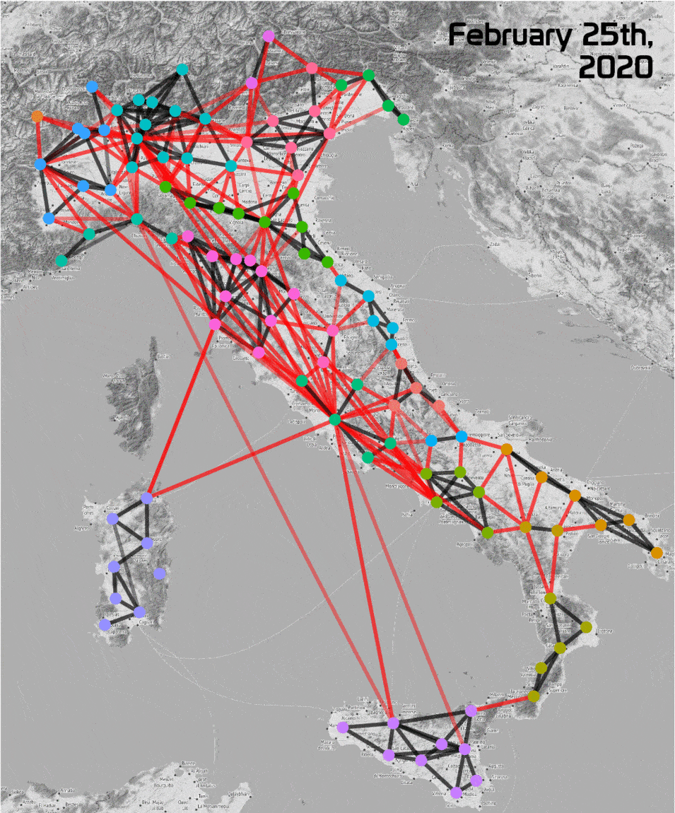

# Lockdown Mobility Network Analysis

*Final project for the course of **Social Network Analysis** at the University of Trieste, A.A. 2019-2020 held by Prof. Susanna Zaccarin and Prof. Domenico De Stefano.*

Analysis of shifts in mobility patterns during Italy's COVID-19 lockdown. Built by [Gabriele Sarti](https://gsarti.com) and [Enrico Fallacara](https://github.com/enricofallacara).

See [`data/README.md`](data/README.md) for specifications about the data used.

## Guidelines

Taken from Moodle:

> The exam will consist in the presentation and discussion, in groups of 2 up to 4 students, on the analysis (description and model fitting) of a real network dataset, explaining the working steps and the obtained results. The writing of a short report is also requested, with the commented R code.
>
> During the presentations, few questions will be asked to assess the individual contributions and preparation on the topics of the course.
>
> Students are asked to carry out the following tasks:
>
> 1) Perform a descriptive analysis of the assigned network(s) (and attributes) dataset using the indices and tools learnt in the course.
>
> 2) Perform an exploratory analysis by finding communities (or alternatively blocks by means of blockmodeling).
>
> 3) Specification and estimation of an ERG model on binary network, choosing an appropriate threshold to dychotomise the weighted relations. Since networks are large-sized, please use a meaningful sub-network to fit the ERGM in a reasonable amount of time.
>
> 4) Perform analysis for each network and compare results
>
>Delivery deadline of the short report (max 10 pages) and the commented R code: **29th June, 11.59 p.m.**

## TO-DOs

### 1

- [x] Review techniques of descriptive analysis presented during the course
- [x] Select a metric to weight edges among those available
- [x] Perform descriptive analysis of the 3 networks in an R script
- [ ] Write report section comparing similarities and differences in the analysis
- [ ] Add comments to the script

### 2

- [x] Review techniques of exploratory analysis for community detection
- [ ] Perform community detection for the 3 networks in an R script
- [ ] Write report section highlighting relevant communities and techniques used
- [ ] Add comments to the script

### 3

- [ ] Review exponential random graphs presented during the course
- [x] Select subnetworks for all three dataset to fit ERGs (All italian provinces, non-looping edges)
- [ ] Select additional features to improve the quality of fit
- [ ] Perform the modeling R script
- [ ] Write report section showing the structure and performances of various models
- [ ] Add comments to the script

**Useful sources:**

- [Italian Public Datasets](https://github.com/italia/awesome-italian-public-datasets) (especially Automobile Club Italia about available number of vehicles)

- [OECD Stats](https://stats.oecd.org/) (see Regions and Cities > Regional Statistics, ITA provices are "Small regions" TL3)

### 4

- [ ] Perform additional analysis to gain more insights about the mobility changes *(find something related to the analysis a geographical networks?)*
- [ ] Write final report section

**Useful sources:**

- [Google COVID-19 Community Mobility Reports](https://www.google.com/covid19/mobility/) for Italy, we can directly compare our results with theirs.