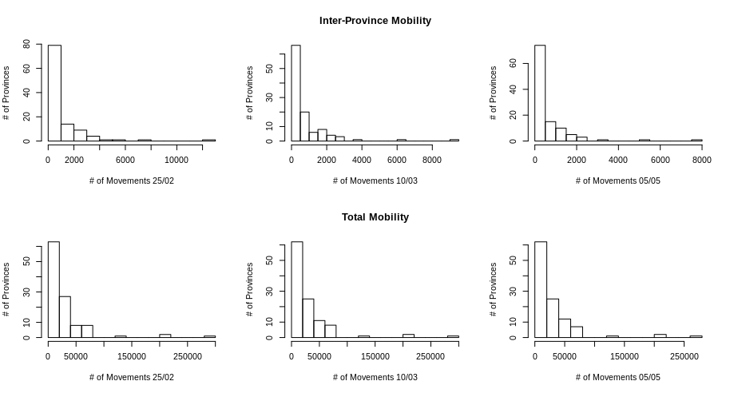

```{r setup, include=FALSE}
knitr::opts_chunk$set(echo = FALSE, fig.align="center")
source('src/utils.R')
source("src/plot.R")

mobility_pre <- read.csv('data/2020-02-25.csv',sep=";")
mobility_mid <- read.csv('data/2020-03-10.csv',sep=";")
mobility_post <- read.csv('data/2020-05-05.csv',sep=";")

graph_pre <- create_graph_from_data(mobility_pre, metric="n", loops=F, zeros = F)
graph_mid <- create_graph_from_data(mobility_mid, metric="n", loops=F, zeros = F)
graph_post <- create_graph_from_data(mobility_post, metric="n", loops=F, zeros = F)

graph_pre_all <- create_graph_from_data(mobility_pre, metric="n", zeros=F)
graph_mid_all <- create_graph_from_data(mobility_mid, metric="n", zeros=F)
graph_post_all <- create_graph_from_data(mobility_post, metric="n", zeros=F)

line2user <- function(line, side) {
  lh <- par('cin')[2] * par('cex') * par('lheight')
  x_off <- diff(grconvertX(0:1, 'inches', 'user'))
  y_off <- diff(grconvertY(0:1, 'inches', 'user'))
  switch(side,
         `1` = par('usr')[3] - line * y_off * lh,
         `2` = par('usr')[1] - line * x_off * lh,
         `3` = par('usr')[4] + line * y_off * lh,
         `4` = par('usr')[2] + line * x_off * lh,
         stop("side must be 1, 2, 3, or 4", call.=FALSE))
}
```

## Introduction

The nation-level lockdown implemented by the Italian Government in order to prevent the spreading of the COVID-19 disease in 2020 greatly affected the mobility patterns of roughly 60 millions Italian citizens and residents. The Italian lockdown was achieved through a sequence of phases characterized by tightening and loosening of restrictions, with the three most relevant dates being:

- The **first lockdown** of ten municipalities of the province of Lodi, forming the first *zona rossa*, shortly after February 21st, 2020.

- The **national lockdown** that restricted travel at intra-municipal level ( except for working necessities and family emergencies) on the evening of March 9th, 2020.

- The **reopening of inter-regional travel** that took place from May 5th, 2020, after a significant drop in the number of positive cases and daily fatalities.

In this report, we analyze how the Italian mobility trends have shifted during the three phases defined by those dates using a dataset containing raw movements of users of the Facebook platform collected between February and May 2020 at a macro-scale level. We begin by presenting data and preprocessing steps that were taken in order to perform the analysis in Section  [\textcolor{blue}{1}](#data). Section [\textcolor{blue}{2}](#desc-anal) contains a diachronic descriptive analysis of the mobility network that highlights shared and different properties of the mobility networks through time. In Section [\textcolor{blue}{3}](#comm-det), we highlight mobility shifts at a provincial level by the means of well-established community detection algorithms. Section [\textcolor{blue}{4}](#modeling) depicts our efforts in modeling the mobility network by the means of exponential random graph models (ERGMs) and temporal exponential random graph models (TERGMs) to show the connection between mobility shifts and COVID-19 spreading statistics. We conclude our study in Section [\textcolor{blue}{5}](#conclusion) by comparing our results with the mobility reports publicly released by Google and Facebook during the lockdown and summarizing our findings.

{#fig:mobility-viz} 

## [1. Data and Preprocessing]{#data}

For our analysis, we leveraged the Movement Range Maps data[^1] published by Facebook on the Humanitarian Data Exchange platform. These data contain movement changes as measured in multiple countries by Facebook during the COVID-19 pandemic. More specifically, we focused only the data available for the Italian mobility network in three specific dates: February 25th (during Lodi red-zoning), March 10th (first day of national lockdown) and May 5th (first day of national reopening). 

[^1]: https://data.humdata.org/dataset/movement-range-maps

For our analysis, we considered only raw estimated movements at provincial level and focused mostly on the analysis of **inter-provincial movements**, since they were the most affected by the lockdown procedure: it should be assumed that we are presenting data about inter-provincial movements only except where explicitly stated.  Raw movements metric were chosen as our main metric as they are intrinsically related to the popularity of actors in the mobility network (i.e. Italian provinces), making them especially suited for standard network analysis methodologies. It is important to note that some movements in the dataset were approximated to a null value for privacy reasons: we discarded them since they were not relevant for our macro-analysis of mobility phenomena.

Since the original dataset presents mobility patterns at three moments of the day (12AM, 8AM and 4PM respectively), we average raw movement values across the three periods to obtain a general mobility measure for each connection between provinces across the entire day. We note that movement values were generally evenly distributed across various moments of the day, with a slight prevalence of movements at 4PM for all the inspected days.

## [2. Diachronic Descriptive Analysis of Mobility Networks]{#desc-anal}

<!--The first insight is given by the sum of the movements in these 3 days. We notice that mobility doesn't change much allowing intra-provincial movements, since inter-province connections have values that are much lower than intra-province ones. Thus, removing the loops, allow us to see only inter-province movements and in this case the mobility is significantly lower:

```{r echo = FALSE}
print(paste("Movements (inter-province): Pre", round(sum(E(graph_pre)$weight)), " -> Mid", 
            round(sum(E(graph_mid)$weight)), " -> Post", round(sum(E(graph_post)$weight))))
```
A graphical representation of this phenomenon is given by the next figure.-->

We start our analysis by visualizing the connectivity of the mobility network through time. Figure [\textcolor{blue}{1}](#fig:mobility-viz) presents inter-provincial movements on Italian soil during three crucial moments of the pandemic. In all three cases, mobility networks are **directed**, **weighted** (accoriding to the raw mobility weight value) and **disconnected**.

<!--We restrict our attention to inter-province movments for the descriptive analysis, since they capture better the variation of mobility and the results for intra-province are empirically quite similar. The graphs are **directed**, **weighted** (accoriding to the metric value) and **disconnected** (this is valid for both implementations).-->

```{r echo = FALSE, fig.height=2.5, fig.cap="\\label{fig:hist_degree} In-degree and out-degree distribution for nodes for the mobility network of February 25th and May 5th, considering only inter-provincial movements."}
V(graph_pre)$deg <- igraph::degree(graph_pre) 
V(graph_pre)$ideg <- igraph::degree(graph_pre, mode="in")   
V(graph_pre)$odeg <- igraph::degree(graph_pre, mode="out")

V(graph_mid)$deg <- igraph::degree(graph_mid) 
V(graph_mid)$ideg <- igraph::degree(graph_mid, mode="in") 
V(graph_mid)$odeg <- igraph::degree(graph_mid, mode="out")

V(graph_post)$deg <- igraph::degree(graph_post) 
V(graph_post)$ideg <- igraph::degree(graph_post, mode="in") 
V(graph_post)$odeg <- igraph::degree(graph_post, mode="out")

par(mfrow=c(1,4))
hist(get_attr(graph_pre, "ideg", "vertex"), xlab ="In-Degree distribution", ylab="# of Provinces", breaks=15, main="")
hist(get_attr(graph_pre, "odeg", "vertex"), xlab ="Out-Degree distribution", ylab="# of Provinces", breaks=15, main="")
text(line2user(line=mean(par('mar')[c(2, 2)]), side=2), 
     line2user(line=2, side=3), 'Feb. 25th Mobility', xpd=NA, cex=1, font=2)
hist(get_attr(graph_post, "ideg", "vertex"), xlab ="In-Degree distribution", ylab="# of Provinces", breaks=15, ylim=c(0,40), main="")
hist(get_attr(graph_post, "odeg", "vertex"), xlab ="Out-Degree distribution", ylab="# of Provinces", breaks=15, ylim=c(0,40), main="")
text(line2user(line=mean(par('mar')[c(2, 3)]), side=2), 
     line2user(line=2, side=3), 'May 5th Mobility', xpd=NA, cex=1, font=2)
```

We note how the decrease in total mobility throughout the lockdown period affected the south-eastern and insular regions of Italy in particular, with most intra-regional connections being dropped after the first lockdown phase. On the other hand, provinces in Lombardy, Tuscany, Veneto, Emilia-Romagna, Lazio and Campania are the least affected. As of May 5th the Italian mobility network still seems heavily impacted by the lockdown and shows no apparent signs of regeneration.

We proceed by analyzing the in-degree and the out-degree distribution of actors. Figure [\textcolor{blue}{2}](#fig:hist-degree) highlights the fact that a majority of nodes have a degree ranging between 1 and 10, with few nodes assuming larger values. We can notice that, with respect to in-degree, large values tends to vanish and the distribution concentrates to small values, indicating that nodes loose their popularity throughout the pandemic. The same happens to the out-degree distribution, idicating that also expansiveness of nodes is also affected.

Table [\textcolor{blue}{1}](#tab:descriptive_analysis) presents a summary of multiple descriptive measures of the mobility network through time. Low values assumed by **network density** indicate that the graph is **sparse** at all times, but the slight decrease through time seems to support the decrease in overall movements we first presented in Figure [\textcolor{blue}{1}](#fig:mobility-viz). We can also observe that the decrease over time in all edge-related values (# movements, # edges, dyad counts, triangles) is related to an increase in the longest geodesic (i.e. the diameter, computed over inverted raw movements). This can be interpreted as provinces becoming increasingly loosely-knit through the pandemic.

For what concerns the **assortativity by degree** measure, we can see that its value for the network increases through time, starting at $0.134$ on February 25th and reaching a value of $0.326$ on May 5th. Since the measure indicates the tendency of nodes having similar degree to connect with each other, this could indicate a clustering of movements across provinces of the same size, reducing the movement from small to large ones.

Table [\textcolor{blue}{1}](#tab:descriptive_analysis) shows how **transitivity** measures for the whole network tend to stay roughly the same through the lockdown phases. Thus, to inspect better this property, we calculate this measure on two subgraphs obtained placing a $\text{threshold}_w = 500$ on edge weights, i.e. considering only connections among provinces that see at least 500 raw movements in a portion of the day. The threshold value was selected by looking at the distribution of weights in the network, noticing that most edges have weights between $0$ to $500$. The subgraphs of nodes below the threshold shows a transitivity (Transitivity sub. lower) that is slightly smaller that the global value and hardly varies through time. On the other hand, the subgraph containing only edges above $\text{threshold}_w$ shows a significant increment of $0.10$ in its transitivity value (Transitivity sub. upper). This can be interpreted as the tendency of big provinces to increase their number of connections throughout the three phases of the lockdown. Transitivity was also computed for the $k$-cores of the graph, where $k=8$ is the minimum value between the coreness values for the three networks (note that only the Feb. 25th network has a value of $k$ bigger than the one we selected, with coreness equal to $10$). The transitivity calculated on these maximal subgraphs has a significant decrease of $0.18$, as we expected, indicating that these subnetworks underwent a significant loss in terms of cohesion through time.

\begin{table}
\begin{center}
\begin{tabular}{l@{\qquad}ccc@{\qquad}ccc}
\toprule
& \multicolumn{1}{c}{\textbf{Feb. 25th}} & \multicolumn{1}{c}{\textbf{March 10th}} & \multicolumn{1}{c}{\textbf{May 5th}} \\
\midrule
\# of provinces & 110 & 110 & 110 \\
\# of edges & 600 & 478 & 434 \\
\# of movements & 119065 & 85258 & 68515 \\
% mobility decrease & - & 30% & 43 % \\
\midrule
Density & .050 & .040 & .036 \\
Diameter & .306 & .506 & .843 \\
Dyad census (MAN) & 279/42/5674 & 230/18/5747 & 206/22/5767 \\
\# of triangles & 918 & 492 & 423 \\
Assortativity by degree & .134  & .251  & .326 \\
\midrule
Global transitivity & .386  & .405 & .417  \\
Transitivity sub. upper & .171  & .206 & .272 \\
Transitivity sub. lower & .315  & .317  & .345  \\
Transitivity k-cores & .796 & .613 & .611 \\
\bottomrule
\end{tabular}
\caption{Descrpitive analysis of the mobility network at different times of the Italian lockdown. We note how a sharp decrease in network connectivity leads to increased assortativity and transitivity measures. The diameter is computed using inverted edge weights ($1/\text{raw movements}$) as proxies for distance in communication.}
\label{tab:descriptive_analysis}
\end{center}
\end{table}

We conclude our descriptive analysis of the network by inspecting node importance by the means of multiple centraliti indices. Since centrality measures treat edge weights as distances and not as connection strengths, weights need to be inverted in a fashion similar to the diameter computation in Table [\textcolor{blue}{1}](#tab:descriptive_analysis). We follow an approach suggested in the literature[@ozyer2019social], converting our raw movement weights $w$ into rescaled inverted movement weights $w'$ that can be used as proxies for distances.

$$w' = \frac{1}{w}\times 10'000$$

We proceed by calculating the **betweenness** scores and the **eigenvector centrality** for nodes in the mobility network, leaving closeness for later since the network is disconnected.

Betweenness remains practically the same in all graphs, besides few small variations. Hovewer, regions of Lazio, Umbria and Abruzzo show an interesting trend where Rome, which has the largest value with respect to neighboring provinces, suffers a decrease in betweenness through time while betweenness of its neighbors increases. Appendix [\textcolor{blue}{A}](#app:betweenness) visualizes this trend. This could indicate that Rome's tendency to influence movements (flows) is slightly lost in favor of its neighbors, a situation that can be motivated by the sudden shift towards remote work.

**Eigenvector centrality** distribution shows that a loss of network influence for northern and southern provinces, while in central Italy the situation remains almost completely unchanged, despite a slight decrease in values. [\textcolor{blue}{B}](#app:eigenvector_centrality) visualizes this trend. We speculate that this can be a direct consequence of northern provinces being the most affected by the pandemic.

We finally compute the **global clustering coefficient** to quantify network cohesion, both **globally**, on **subgraphs** above $\text{threshold}_w$ and on **k-cores components** of original graphs with $k=8$.

To summarize, the decrease of movements caused by lock-down measures causes a loss of influence of the nodes in the whole network, with an increasing tendecy of similar degree nodes to connect with each others, indicating that movements from small provinces to large ones decreases in favor of smaller and geographically-closer provinces. The opposite happens for large provinces, with an increase in assortativity reflecting a decrease in mobility from large to small provinces reduce in favor of movements among large ones.

{#fig:histo_mobility}

## [3. Analyzing Mobility Communities]{#comm-det}

We limit ourselves to the analysis of `inbound_strength`, i.e. the sum of the weights of inbound edges to each node. Intuitively, it can be regarded as a proxy for the importance of the node inside the network. Figure [\textcolor{blue}{N}](#fig:histo_mobility) shows that movements across provinces follow a power law that is typical for those types of networks, with very few provinces accounting for most of the movements. We see from the histograms that the value of `inbound_strength` is much higher when accounting for intra-provincial movements. This is also evident in the visualizations of Appendix [\textcolor{blue}{X}](#app:eigenvector_centrality), where this value is used to  weight edge widths. While total movements don't seem to be affected, we can see a drop of roughly 30% in inter-provincial movements between February 25th and March 10th, with a further 13% decrease in mobility between March 10th and May 5th. These percentages match our intuition that inter-provincial mobility suffered the most from lockdown measures.

We proceeded to compute and visualize the coreness of the network, as shown in Appendix [\textcolor{blue}{X}](#app:coreness). As expected, removing intra-provincial movements (looping edges) doesn't affect at all the coreness structure. From the coreness plots structure it is evident how north-eastern, southern and insular provinces have a much lower number of connections with respect to central (e.g. Tuscany) and north-western (e.g. Lombardy, Piedmont) ones. Calabrian and Sardinian provinces have the lowest number of connections.

In order to account for the intrinsically weighted structure of our networks, we developed a **weighted version of the coreness algorithm** that groups vertices in bins of fixed length based on their weights and uses bin membership as a proxy for weighted coreness. In our specific case, we used a bin size of 500 raw movements for the network without intra-provincial movements, and 10'000 for the network containing all movements. The details of our implementation are presented in Algorithm [\textcolor{blue}{1}](#alg:weighted-coreness). We see from the results shown in Appendix [\textcolor{blue}{X}](#app:wcoreness) that our approach effectively highlights the centrality of northwestern provinces when we account only for inter-provincial movements, while it shows a strong correlation with population counts when accounting for all external and internal movements in the province.

\begin{algorithm}
\SetAlgoLined
\DontPrintSemicolon
 \textit{Input:} Network $\mathcal{G}(V_G,E_G)$, strenght bin size $b$\;
 Set current weighted k-core subgraph $\mathcal{K}(V_k, E_k) \leftarrow \mathcal{G}$\;
 Set max inbound strength $S \leftarrow \max{(\text{strength}(V))}$\;
 Set index $i \leftarrow 1$\;
 \For{min in $b, 2b, 3b,\dots S$}{
    Create bin graph $\mathcal{B}(V_B,E_B) \leftarrow \text{Induced subgraph}(\mathcal{K}, \text{ strength}\small(V_k\small) \leq min)$\;
    \If{$|V_B| > 0$}{
        Set \textit{wcore} of $V_G$ that were not filtered in $\mathcal{B}$ to $i$\;
        $\mathcal{G}(V_B \cap V_G)[wcore] \leftarrow i$\;
        $i \leftarrow i+1$\;
    }
    Set current weighted k-core subgraph to the complement of bin graph\;
    $\mathcal{K} \leftarrow \text{Induced subgraph}(\mathcal{K}, \text{ strength}\small(V_k\small) > min)$\;
 }
 \textit{Output:} Network $\mathcal{G}(V_G,E_G)$ with \textit{wcore} vertex attributes\;
 \caption{Weighted Coreness}
 \label{alg:weighted-coreness}
\end{algorithm}

For the second part of the community analysis, we proceeded only with the network of inter-provincial movements since the presence of looping edges wasn't relevant for detecting communities inside the network. We inspected the component structure of the network in the three analyzed dates, finding that a single giant component comprising almost all the provinces, with few isolated nodes left aside in Southern Italy, was present at all times. This isn't surprising, as we expected some level of communication at a national level at all times for business and family-related reasons despite the lockdown.

In Appendix [\textcolor{blue}{X}](#app:components) we show the similarity between the structure of cliques through time and the components found by considering network actors with weighted coreness rank > 2, i.e. with at least 1000 inter-provincial outbound movements at all times. This highlights the fact that most tight-knit communities are also the ones having the higher number of connections in general, reflecting the principle of preferential attachment which is commonly verified in many real-world social networks. This fact is also verified by the presence of a **small-worldness index** above 3 at all times, and a global transitivity that is significantly above chance. Both cliques and weighted coreness components highlight the centrality of Milan and its neighbouring provinces, Tuscany provinces and the Rome-Naples macro-region. Weighted coreness components further provide additional information by highlighting the high connectivity of Veneto and representing well the drop in connectivity during the lockdown.

To conclude the section, we performed some community detection experiments leveraging two well-established algorithms. The **Girvan-Newman algorithm** finds communities by progressively removing edges based on their betweenness.

The **Label propagation algorithm**, instead, iteratively sets node community memberships based on the weighted most common membership across neighbouring nodes until convergence. This approach doesn't require inverting raw movements weights $w$ since larger edge weights correspond to stronger connections. Results produced by the two methods are presented descriptively in Table [\textcolor{blue}{X}](#tab:clustering) and visually in Appendix [\textcolor{blue}{X}](#app:clustering). We could not apply standard multi-level modularity optimization methods given the directed nature of our network.

\begin{table}
\begin{center}
\begin{tabular}{l@{\qquad}ccc@{\qquad}ccc}
\toprule
 & \multicolumn{3}{c}{\textbf{Girvan-Newman}} & \multicolumn{3}{c}{\textbf{Label Propagation}} \\
 \cmidrule(lr){2-4}
 \cmidrule(lr){5-7}
& \multicolumn{1}{c}{\textbf{25/02}} & \multicolumn{1}{c}{\textbf{10/03}} & \multicolumn{1}{c}{\textbf{05/05}} & \multicolumn{1}{c}{\textbf{25/02}} & \multicolumn{1}{c}{\textbf{10/03}} & \multicolumn{1}{c}{\textbf{05/05}} \\
\midrule
\# communities & 36 & 60 & 7 & 22 & 22 & 24\\
modularity $Q$ & .39 & .25 & .39 & .51 & .57 & .59 \\
\midrule
$\delta_{int}$ & .19 (.38) & .12 (.31) & .54 (.37) & .78 (.21) & .68 (.25) & .73 (.23) \\
$\delta_{ext}$ & .07 (.05) & .08 (.04) & .01 (.01) & .04 (.03) & .03 (.01) & .03 (.01) \\
Gini index & .96 (.18) & .97 (.14) & .66 (.37) & .78 (.22) & .76 (.22) & .80 (.21) \\
\bottomrule
\end{tabular}
\caption{Values of the metrics computed using two community detection approaches. Values for intra-cluster density $\delta_{int}$, inter-cluster density $\delta_{ext}$ and Gini index are presented in the \textit{mean (stdev)} format.}
\label{tab:clustering}
\end{center}
\end{table}

The label propagation algorithm appears to be more effective at modeling the community structure of the networks at various times. Communities found with label propagation closely approximate regional membership at all times, a fact that matches the empirical presence of regional hubs of communication across the Italian territory. It is interesting to note that both algorithms correctly highlight a decrease in inter-community edges over time, which is also made evident by the drastic reduction in red inter-cluster edges in the plots of Appendix [\textcolor{blue}{X}](#app:clustering).

## [4. Modeling Mobility Patterns]{#modeling}

In order to implement ERGMs on our networks, we decide to insert some **auxiliary data** that could allow us a better model fitting. These data came from two different dataset:

- NOME DATASET, that contains informations about **population**, **population density**, **surface** and **municipalities**, aggregated at province level.

- COVID-19 italian dataset, that contains informations about the numer of **covid cases** at province level and number of **covid deaths** at regional level.

These variables are chosen because they can be significant in our analysis, as they could influence the movements between the different regions and/or provinces.

After adding these variables, we procede with the specification and the estimation of three different models, one for each graph. The general idea in order to specify the model is inspired by the stepAIC() function that performs backward model selection by starting a "maximal" model, which is then trimmed down: starting from the maximal model, we remove iteratively the less significant variable at each step, until we obtain a model in which all the variables are significant, then we select the one that has the lowest AIC value. 

The three final models are:

```{r,eval=FALSE, echo = TRUE}
model_pre <- ergm(gc_pre ~ edges + mutual + nodematch('region', diff=F) + nodecov('ideg')
                           nodecov('out_strength'))
model_mid <- ergm(gc_mid ~ edges + mutual  + nodematch('region', diff=F) + nodecov('odeg'))
model_post<-ergm(gc_post ~ edges + mutual+ nodecov('covid_deaths') + nodecov('ideg')
                           nodematch('region', diff=F) +nodecov('eig_vect_centr'))
```

All the three models use informations about the number of edges, mutuality (number of pairs of actors $i$ and $j$ for which
$(i \to j)$ and $(j \to i)$ both exist) and homofily, given by the match by region, of the networks.  They differ instead in the covariates they use: the first two models don't use statistics relative to COVID-19 and this make sense, because on those dates the data relating to the epidemic did not yet show its real extent on the territory (low values of covid cases and deaths). Instead, the third model uses the covid deaths, using also the eignevector centrality that reflects the node's centralization property. 

We notice an important thing: these 3 models shows a sort of *performance decay*, in the sense that the first model, according to Goodness-of-fit diagnostics performs pretty well, while the second and third show worse and worse performances, even if for all the three models the MCMC diagnostics are good and they include all the relavant predictors. This could be a hint that three single ERGM models are not suitable for our purpose, thus considering a temporal network data analysis seems more appropriate for our problem, in which we have a graph that changes through three different moments of time.

*CITARE PLOT GOF AND/OR MCMC FOR THE THREE BASIC MODELS*


## [5. Discussion and Conclusion]{#conclusion}


# References

<div id="refs"></div>

\blandscape

# [Appendix]{#appendix}

## [A. Shift in Betweenness Across Regions of Central Italy]{#app:betweenness}

\vspace{5mm}

\begin{figure}
\begin{center}
\includegraphics{img/btw_regions.png}
\caption{From left to right: Feb. 25th, March 10th and May 5th mobility situation of provinces belonging to the regions of Lazio, Umbria and Abruzzo. Edge transparency represent the number of raw movements, while vertex size represent the betweenness of nodes in the total network.}
\end{center}
\end{figure}

\newpage

## [B. Shift in Provinces Influence on Mobility During Italy Lockdown]{#app:eigenvector_centrality}

\vspace{5mm}

\begin{figure}
\begin{center}
\includegraphics{img/eig_vect_italy.png}
\caption{From left to right: Feb. 25th, March 10th and May 5th mobility for provinces on the whole territory. Edge transparency represent the number of raw movements, while vertices sizes and colors represent the eigenvector centrality and the regional membership of nodes in the network.}
\end{center}
\end{figure}

\newpage

## [A. Coreness Plots for Feb. 25th, 2020 Mobility Network]{#app:coreness}

\vspace{5mm}

\begin{figure}
\begin{center}
\includegraphics{img/coreness.png}
\caption{Finding the .rproj file for Chapter 3}
\end{center}
\end{figure}

\newpage

## [B. Weighted Coreness Plots for Feb. 25th, 2020 Mobility Network]{#app:wcoreness}

\vspace{5mm}

\begin{figure}
\begin{center}
\includegraphics{img/weighted_coreness.png}
\caption{Finding the .rproj file for Chapter 3}
\end{center}
\end{figure}

\newpage

## [C. Connected Components and Cliques for the Three Lockdown Phases]{#app:components}

\vspace{5mm}

\begin{figure}
\begin{center}
\includegraphics{img/comp_cliques.png}
\caption{Finding the .rproj file for Chapter 3}
\end{center}
\end{figure}

\newpage

## [C. Community Detection using Girvan-Newman Algorithm and Label Propagation]{#app:comm_det_plots}

\vspace{5mm}

\begin{figure}
\begin{center}
\includegraphics{img/clustering.png}
\caption{Finding the .rproj file for Chapter 3}
\end{center}
\end{figure}

\elandscape