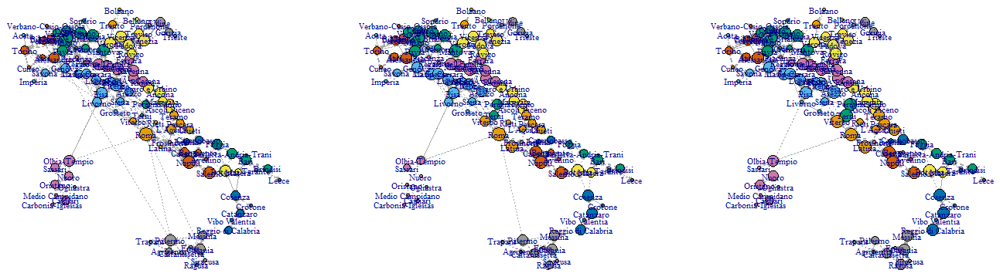

```{r setup, include=FALSE}
knitr::opts_chunk$set(echo = FALSE)
source('src/utils.R')
source("src/plot.R")

mobility_pre <- read.csv('data/2020-02-25.csv',sep=";")
mobility_mid <- read.csv('data/2020-03-10.csv',sep=";")
mobility_post <- read.csv('data/2020-05-05.csv',sep=";")

graph_pre <- create_graph_from_data(mobility_pre, metric="n", loops=F, zeros = F)
graph_mid <- create_graph_from_data(mobility_mid, metric="n", loops=F, zeros = F)
graph_post <- create_graph_from_data(mobility_post, metric="n", loops=F, zeros = F)
```

## Introduction

The aim of this paper is to analyze shifts in mobility patterns during Italy's COVID-19 lockdown. The dataset contains the estimated raw  number of movements *n* in 3 days during the Covid crisis, filtered by country = IT. The 3 days refers to the **first local lockdown** (25/02/20 Lodi province), the **global lockdown** (03/10/20) and the **end of global lockdown**, at region level (05/05/20). In this dataset are present different metric to estimate movements, we have selected the metric *n* because it represents a kind of measure of popularity.

## Descriptive Analysis

A first insight is given by the sum of the movements in these 3 days. We notice that mobility doesn't change much allowing intra-provincial movements, since inter-province connections have values that are much lower than intra-province ones. Thus, removing the loops, allow us to see only inter-province movements and in this case the mobility is significantly lower:

```{r echo = FALSE}
print(paste("Movements (inter-province): Pre", round(sum(E(graph_pre)$weight)), " -> Mid", 
            round(sum(E(graph_mid)$weight)), " -> Post", round(sum(E(graph_post)$weight))))
```
A graphical representation of this phenomenon is given by Fig-1.

*PLOTTARE 3 IMMAGINI CHE COMPONGONO LA GIF?*

We restrict our attention to inter-province movments for the descriptive analysis, since they capture better the variation of mobility and the results for intra-province are empirically quite similar. The graphs are **directed**, **weighted** (accoriding to the metric value) and **disconnected** (this is valid for both implementations).

From the in-degree and out-degree distribution of the 3 graphs, it is highlighted that the majority of nodes have degree between 1 and 10, with few nodes that assumes bigger values. We can notice that, for in-degree, large values tends to vanish and the distribution concentrates to small values, indicating that nodes loose their popularity through time. The same happens to the out-degree distribution, idicating that also expansiveness of nodes tends to reduce.

```{r echo = FALSE, fig.height=2}
V(graph_pre)$deg <- igraph::degree(graph_pre) 
V(graph_pre)$ideg <- igraph::degree(graph_pre, mode="in")   
V(graph_pre)$odeg <- igraph::degree(graph_pre, mode="out")

V(graph_mid)$deg <- igraph::degree(graph_mid) 
V(graph_mid)$ideg <- igraph::degree(graph_mid, mode="in") 
V(graph_mid)$odeg <- igraph::degree(graph_mid, mode="out")

V(graph_post)$deg <- igraph::degree(graph_post) 
V(graph_post)$ideg <- igraph::degree(graph_post, mode="in") 
V(graph_post)$odeg <- igraph::degree(graph_post, mode="out")

par(mfrow=c(1,4))
hist(get_attr(graph_pre, "ideg", "vertex"), xlab ="In-Degree distribution", ylab="# of Provinces", main = "Mobility pre lock.", breaks=15)
hist(get_attr(graph_post, "ideg", "vertex"), xlab ="In-Degree distribution", ylab="# of Provinces", main = "Mobility post lock.", breaks=15)
hist(get_attr(graph_pre, "odeg", "vertex"), xlab ="Out-Degree distribution", ylab="# of Provinces", main = "Mobility pre lock.", breaks=15)
hist(get_attr(graph_post, "odeg", "vertex"), xlab ="Out-Degree distribution", ylab="# of Provinces", main = "Mobility post lock.", breaks=15)

```

The **network density**, presented in Table-1, indicates, first, that the graph are **sparse**, since the very low values that assumes this quantity, and second, that the denisty reduces over time, indicating, like the in-degree and out-degree distributions, that the movements significantly decreases between the provinces through time.

In order to implement centrality measures, we have to invert the weights of our graphs. This have to be done because actual weights represent a sort of strength measure between nodes, not a distance(cost) measure. After that we can calculate the **betweenness** and the **eigenvector centrality** for the graphs. Note that the closeness will be calculated later, because this measure is only meaningful in a connected graph.



